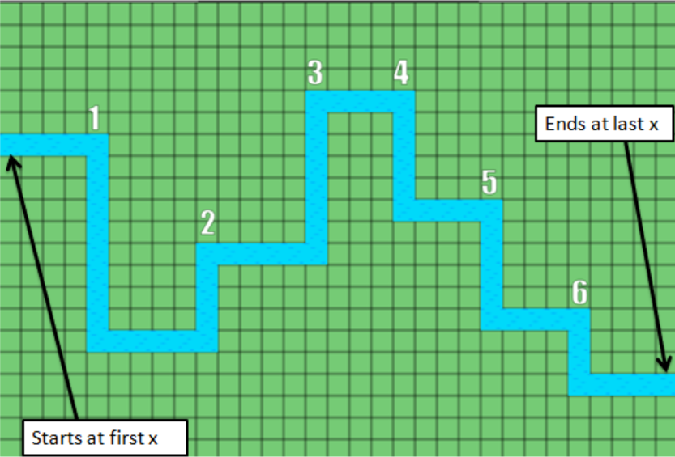
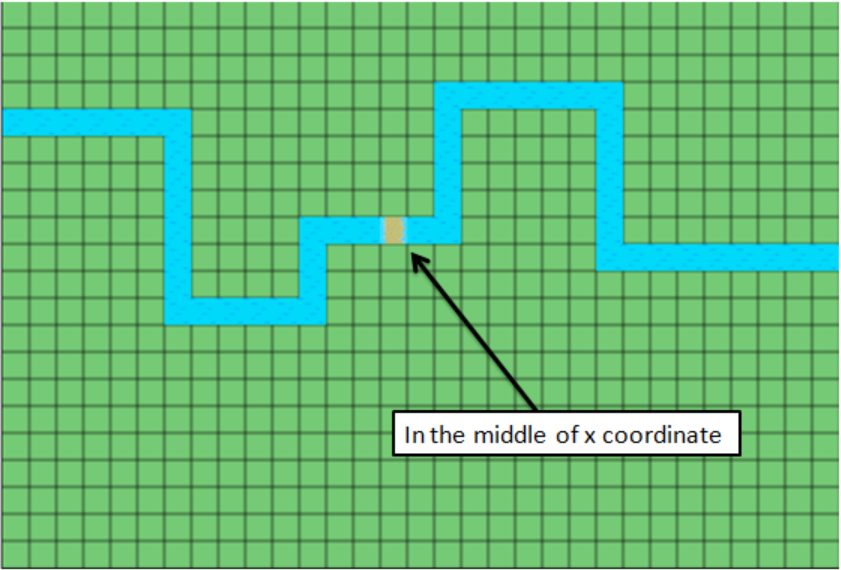
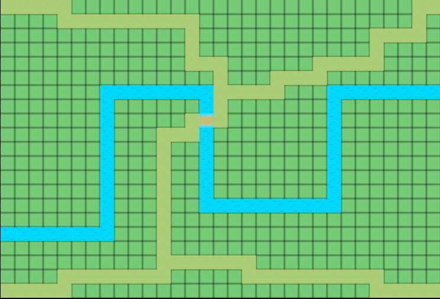
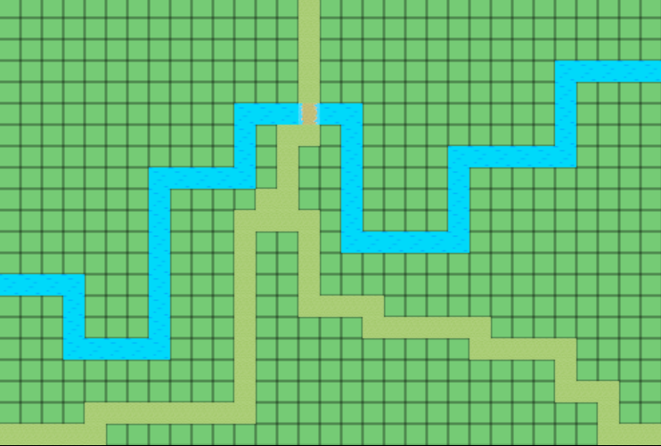
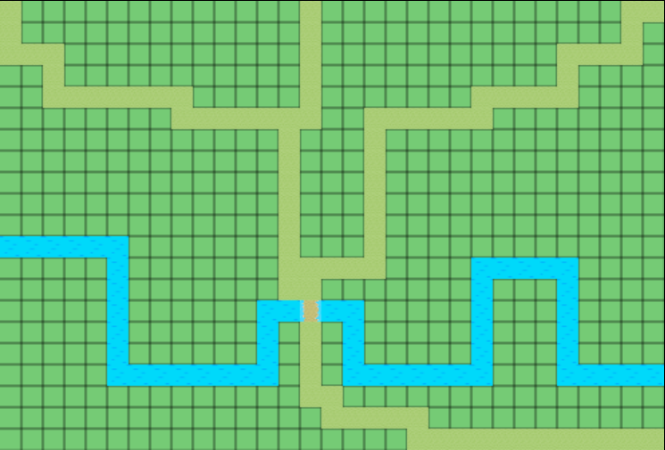
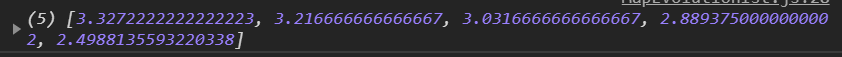
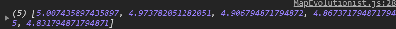
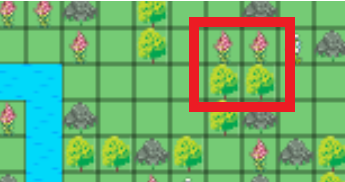

# Description

At the beginning user creates first generation of gardens. They are created randomly. Only constraints applied when first creation are:
- brook must start at the first x tile and end at the last x 
- brook must have 4-7 breaks 
- any brook's water tile cannot be on first/last y tile

- bridge is always in the middle of x coordinate 

- each path is generated from start point to bridge 
- to path generation is used A* algorithm
- depending on the ratio of area above brook and area below brook, are set paths 
start points
    1. If ratio of larger area to smaller area is > 0.8, then in each map corner is set path start point and paths are generated in such way:
    
    2. If ratio of larger area to smaller area is <=0.8 and >0.45, larger area will have 2 path start points on its side (in corner) and smaller area will have only one start point at the middle of x coordinate:
    
    3. If ratio of larger area to smaller area is <=0.45, larger area will have 3 path start points on its side (2 in corners, 1 in the middle of x coordinate) and smaller area will have only one start point at the middle of x coordinate:
    
- flora consists of 4 elements: tree, rock, flower1, flower2
- flora must cover at least 1/4 and maximum 3/4 empty tiles after brook, bridge, paths generation

# How it works?
1.User generates first generation of gardens using "Generate First Generation" button. In browser console will occur information about preferred by algorithm metrics, for example
```
Brook distance priority: 3
Coverage along brook priority: 2
Flora squares priority: 1.5
```
In this case brook distance from the middle of y coordinate has the highest priority.

2.Then user may generate next generations of gardens using buttons that allow to generate respectively 1, 5, 20, 100 next generations. 

After click any of those buttons in console will appear top 5 gardens' scores for previous generation. 

Gardens with best scores are used to create new gardens in next generation.
After many generations scores will be much better


# How best gardens are selected?

Selection is based on these criterias:
- brook should be as close to middle of y axis as possible  
- high flora coverage along brook is preferred
- the more flora square, the better 



The impact of those criterias may be 'adjusted' by changing priorities in `MapEvaluator.js`:
```
const BrookDistancePriority = 3;
const CoverageAlongBrookPriority = 2;
const FloraSquaresPriority = 1.5;
```